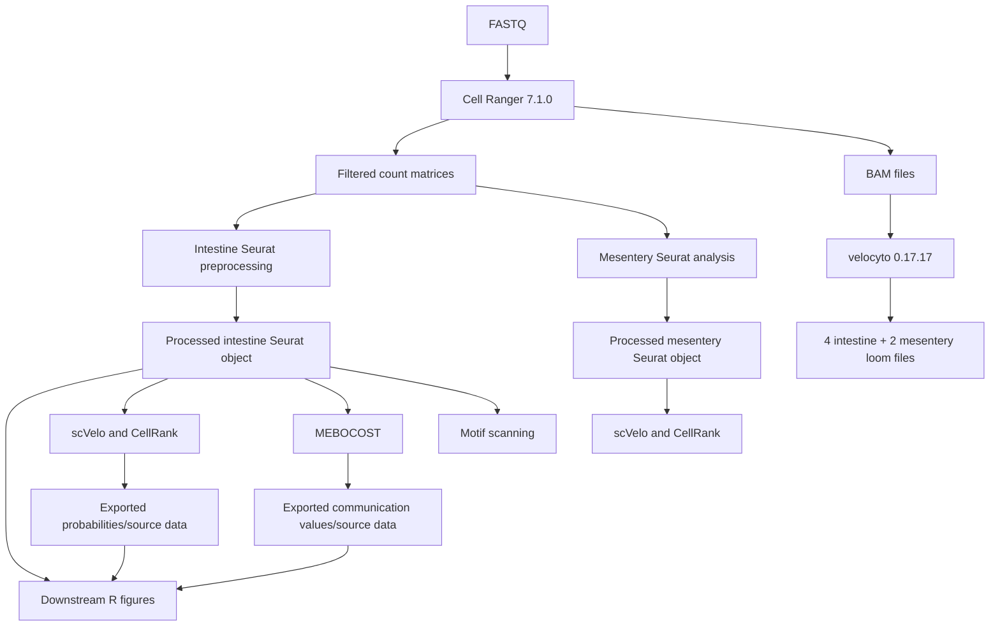

# Analysis workflow

```mermaid
flowchart TD
    A[FASTQ] --> B[Cell Ranger 7.1.0]
    B --> C[Filtered count matrices]
    B --> D[BAM files]
    D --> E[velocyto 0.17.17]
    E --> F[4 intestine + 2 mesentery loom files]
    C --> G[Intestine Seurat preprocessing]
    C --> H[Mesentery Seurat analysis]
    G --> I[Processed intestine Seurat object]
    H --> J[Processed mesentery Seurat object]
    I --> K[Downstream R figures]
    I --> L[scVelo and CellRank]
    J --> M[scVelo and CellRank]
    I --> N[MEBOCOST]
    I --> O[Motif scanning]
    L --> P[Exported probabilities/source data]
    N --> Q[Exported communication values/source data]
    P --> K
    Q --> K
```
